# Seyvin website — section snapshots + complete copy inventory (dark theme)

- **Audience**: non-technical stakeholders reviewing messaging and UX copy
- **Capture mode**: viewport screenshots (1100×850), dark theme
- **Source**: `http://localhost:5173/`
- **Render order** (from `src/App.jsx`): Header → Hero → DataAnalysis → ProblemStatement → Benefits → Services → Process → Features → Clients → Integrations → FAQ → Comparison → Security (`Team`) → CTA → Footer
- **Not rendered** (in current build): Reviews, Pricing (commented out in `src/App.jsx`)

---

## 00) Header (`Header`)

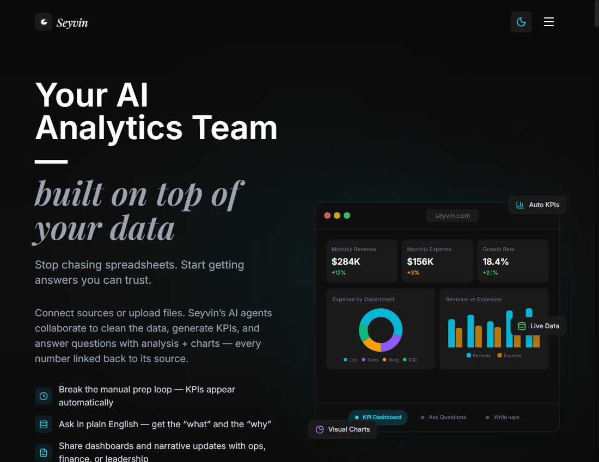

- **DOM area**: `div#root > ... > header.fixed ... > div.section-container`
- **Logo**
  - **Brand name**: “Seyvin”
- **Primary nav links** (desktop)
  - “Features” → `#features`
  - “How it works” → `#process`
  - “Use cases” → `#clients`
  - “Beta partner program” → `#pricing` (note: Pricing section is currently not rendered)
- **Secondary links** (desktop, 2xl breakpoint)
  - “Integrations” → `#integrations`
  - “FAQ” → `#faq`
- **Primary CTA**
  - Button label: **“Book 15-min beta demo”**
- **Theme toggle**
  - Accessible label text switches between:
    - “Switch to light mode”
    - “Switch to dark mode”
- **Mobile**
  - Menu button accessible label switches between:
    - “Open menu”
    - “Close menu”
  - Mobile menu includes:
    - Same primary nav link labels as above
    - Secondary links: “Integrations”, “FAQ”
    - CTA button label: **“Book 15-min beta demo”**

---

## 01) Hero (`Hero`, `#hero`)

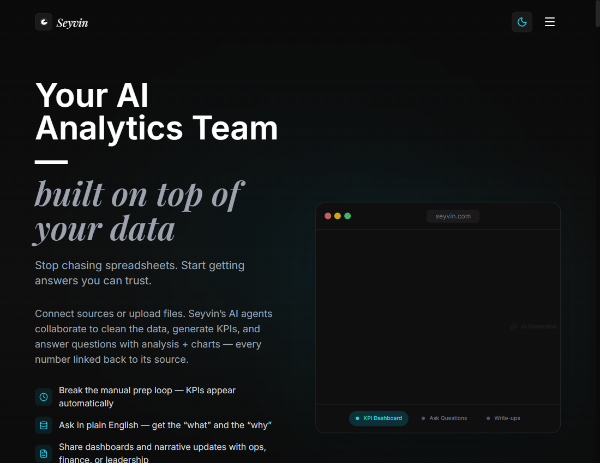

- **Primary headline (H1)**
  - “Your AI Analytics Team —”
  - “built on top of your data”
- **Subheadline (paragraph)**
  - “Stop chasing spreadsheets. Start getting answers you can trust.”
- **Body paragraph**
  - “Connect sources or upload files. Seyvin’s AI agents collaborate to clean the data, generate KPIs, and answer questions with analysis + charts — every number linked back to its source.”
- **Key benefit list (3 items)**
  - “Break the manual prep loop — KPIs appear automatically”
  - “Ask in plain English — get the “what” and the “why””
  - “Share dashboards and narrative updates with ops, finance, or leadership”
- **Primary CTA**
  - Button label: **“Book 15-min beta demo”**
- **Secondary CTA**
  - Button label: “See how it works”
- **Trust signals (inline)**
  - “Secure OAuth”
  - “Limited beta spots”
  - “No credit card”
- **Scroll affordance**
  - Link target: `#data-analysis` (no visible label)

### Hero product visual (slideshow content copy)
The right-side product visual rotates through 3 slides; all text below is visible within that preview.

- **Slide selector labels**
  - “KPI Dashboard”
  - “Ask Questions”
  - “Write-ups”

#### Slide 1: KPI Dashboard
- **KPI card labels**
  - “Monthly Revenue” (value: “$284K”, change: “+12%”)
  - “Monthly Expense” (value: “$156K”, change: “+3%”)
  - “Growth Rate” (value: “18.4%”, change: “+2.1%”)
- **Chart titles / legends**
  - “Expense by Department”
    - Legend: “Ops”, “Sales”, “Mktg”, “R&D”
  - “Revenue vs Expenses”
    - Legend: “Revenue”, “Expense”
- **Floating callouts (badges)**
  - “Auto KPIs”
  - “Visual Charts”
  - “Live Data”

#### Slide 2: AI Conversation
- **User question**
  - “What are sales this month?”
- **Assistant header**
  - “Seyvin Assistant”
- **Insight card**
  - “Sales reached $284,500 this month”
  - “12% increase from last month. Enterprise segment drove 68% of growth.”
- **Recommendation card**
  - “Recommendation: Focus Q2 campaigns on Enterprise segment for continued momentum.”
- **Source chip**
  - “Source:”
  - “Google Drive”
- **Floating callouts (badges)**
  - “Natural Language”
  - “Source Linked”
  - “AI Insights”

#### Slide 3: Report Generation
- **User prompt**
  - “Draft a monthly performance update”
- **Assistant status header**
  - “Generating Update...”
- **Report preview title**
  - “Performance Update”
- **Report preview body (teaser)**
  - “Q1 2024 showed strong performance with total revenue of $852K, a 15% increase YoY. Operating expenses remained controlled at $468K...”
- **Key Insights block**
  - “Key Insights:”
  - “Revenue growth exceeded targets by 8%”
  - “Gross margin improved to 45.2%”
- **Export row**
  - “Export as:”
  - Buttons: “PDF”, “DOCX”, “PPT”
- **Floating callouts (badges)**
  - “Shareable”
  - “Multi-format”
  - “AI Generated”

---

## 02) “Sound familiar?” (`DataAnalysis`, `#data-analysis`)

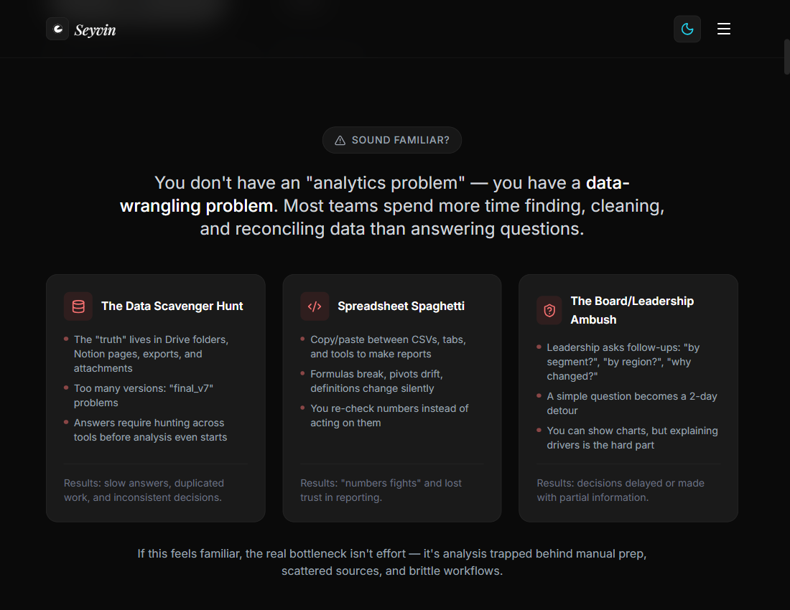

- **Badge**
  - “SOUND FAMILIAR?”
- **Main statement (paragraph)**
  - “You don't have an "analytics problem" — you have a data-wrangling problem. Most teams spend more time finding, cleaning, and reconciling data than answering questions.”
- **Pain point cards (3)**
  - **Card 1 title**: “The Data Scavenger Hunt”
    - Bullets:
      - “The "truth" lives in Drive folders, Notion pages, exports, and attachments”
      - “Too many versions: "final_v7" problems”
      - “Answers require hunting across tools before analysis even starts”
    - Footer line: “Results: slow answers, duplicated work, and inconsistent decisions.”
  - **Card 2 title**: “Spreadsheet Spaghetti”
    - Bullets:
      - “Copy/paste between CSVs, tabs, and tools to make reports”
      - “Formulas break, pivots drift, definitions change silently”
      - “You re-check numbers instead of acting on them”
    - Footer line: “Results: "numbers fights" and lost trust in reporting.”
  - **Card 3 title**: “The Board/Leadership Ambush”
    - Bullets:
      - “Leadership asks follow-ups: "by segment?", "by region?", "why changed?"”
      - “A simple question becomes a 2-day detour”
      - “You can show charts, but explaining drivers is the hard part”
    - Footer line: “Results: decisions delayed or made with partial information.”
- **Transition line (paragraph)**
  - “If this feels familiar, the real bottleneck isn't effort — it's analysis trapped behind manual prep, scattered sources, and brittle workflows.”

---

## 03) The challenge (`ProblemStatement`, `#problem-statement`)

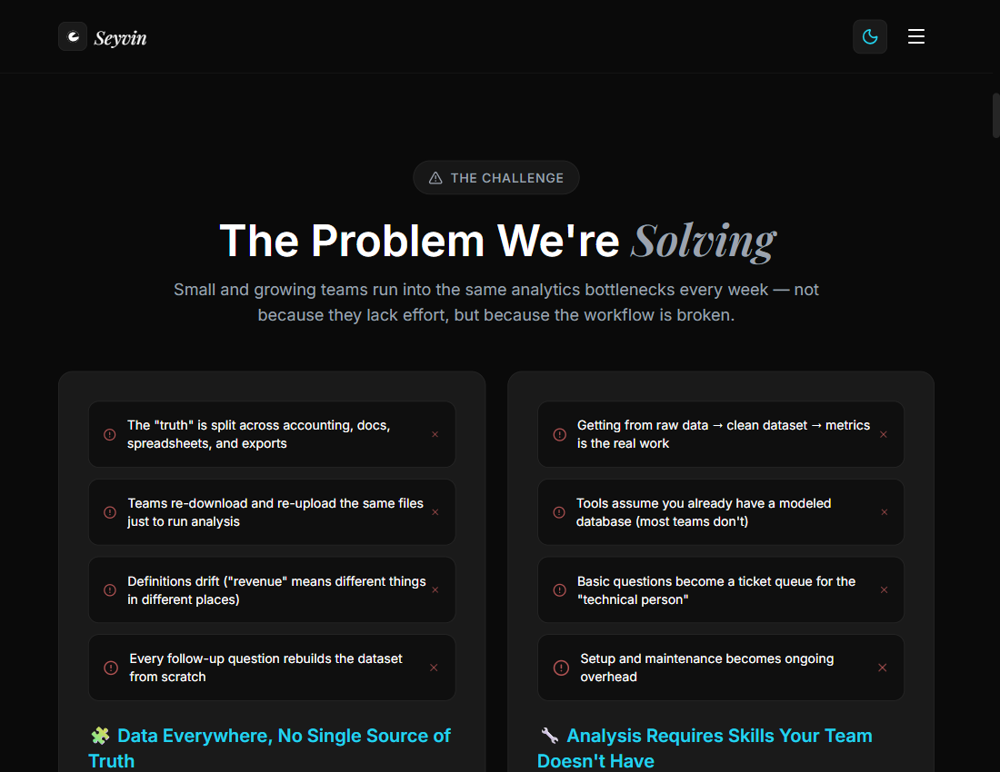

- **Section header**
  - Badge: “THE CHALLENGE”
  - Title: “The Problem We're”
  - Title accent: “Solving”
  - Description: “Small and growing teams run into the same analytics bottlenecks every week — not because they lack effort, but because the workflow is broken.”

### Cards and copy inventory

#### Card: Data Everywhere, No Single Source of Truth
- List items:
  - “The "truth" is split across accounting, docs, spreadsheets, and exports”
  - “Teams re-download and re-upload the same files just to run analysis”
  - “Definitions drift ("revenue" means different things in different places)”
  - “Every follow-up question rebuilds the dataset from scratch”
- Title line:
  - “Data Everywhere, No Single Source of Truth”
- Quote:
  - “We have the data — we just can't trust one place to answer quickly.”
- Bridge sentence:
  - “You don't need another dashboard — you need a reliable way to consolidate and query real data.”

#### Card: Analysis Requires Skills Your Team Doesn't Have
- List items:
  - “Getting from raw data → clean dataset → metrics is the real work”
  - “Tools assume you already have a modeled database (most teams don't)”
  - “Basic questions become a ticket queue for the "technical person"”
  - “Setup and maintenance becomes ongoing overhead”
- Title line:
  - “Analysis Requires Skills Your Team Doesn't Have”
- Quote:
  - “We can't afford a data analyst — and nobody wants to learn SQL.”

#### Wide card: Slow Time-to-Insight
- Quote:
  - “Reporting cycles repeat weekly and monthly. By the time the report is ready, the business has moved on.”
- Title: “Slow Time-to-Insight”
- Paragraph:
  - “Reporting cycles repeat weekly and monthly. By the time the report is ready, the business has moved on — and follow-up questions restart the work.”
- Tags:
  - “Manual prep”
  - “Stale metrics”
  - “Follow-up delay”
  - “Numbers fights”

#### Wide card: Prohibitive Costs + AI That Can't Be Trusted
- Title: “Prohibitive Costs”
- Quote:
  - “The hidden tax of manual analytics work adds up fast.”
- Title: “AI That Can't Be Trusted”
- Quote:
  - “Generic AI sounds confident without being grounded in your data.”

### Transition to next section (paragraph)
- “Seyvin fixes the bottleneck by acting like an AI Data Analyst on top of your real sources: connect QuickBooks/Drive/Notion or upload files, we automatically ingest and clean the data, then you ask questions and get analysis with charts — plus dashboards and narrative reports you can download or share.”

---

## 04) Benefits (`Benefits`, `#benefits`)

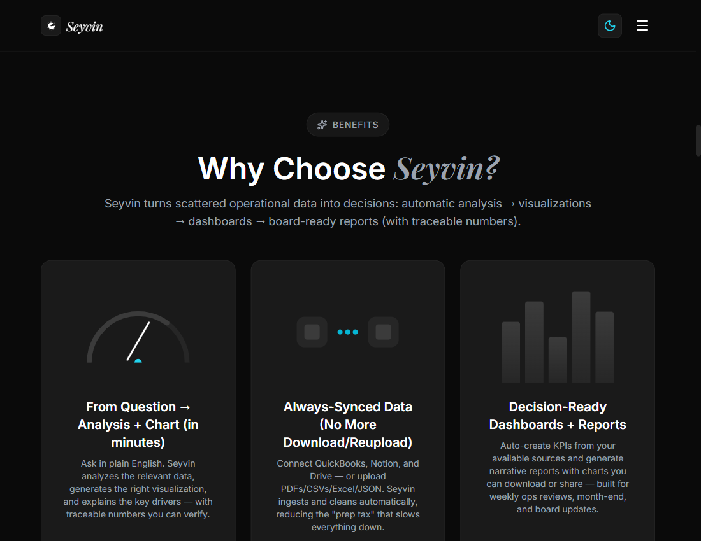

- **Section header**
  - Badge: “BENEFITS”
  - Title: “Why Choose”
  - Title accent: “Seyvin?”
  - Description: “Seyvin turns scattered operational data into decisions: automatic analysis → visualizations → dashboards → board-ready reports (with traceable numbers).”

### Benefit cards (3)
- **Card 1 title**: “From Question → Analysis + Chart (in minutes)”
  - Description: “Ask in plain English. Seyvin analyzes the relevant data, generates the right visualization, and explains the key drivers — with traceable numbers you can verify.”
- **Card 2 title**: “Always-Synced Data (No More Download/Reupload)”
  - Description: “Connect QuickBooks, Notion, and Drive — or upload PDFs/CSVs/Excel/JSON. Seyvin ingests and cleans automatically, reducing the "prep tax" that slows everything down.”
- **Card 3 title**: “Decision-Ready Dashboards + Reports”
  - Description: “Auto-create KPIs from your available sources and generate narrative reports with charts you can download or share — built for weekly ops reviews, month-end, and board updates.”

### Transition line (paragraph)
- “Explore what the platform can do — and how we support beta partners every step of the way.”

---

## 05) Platform & beta partner support (`Services`, `#services`)

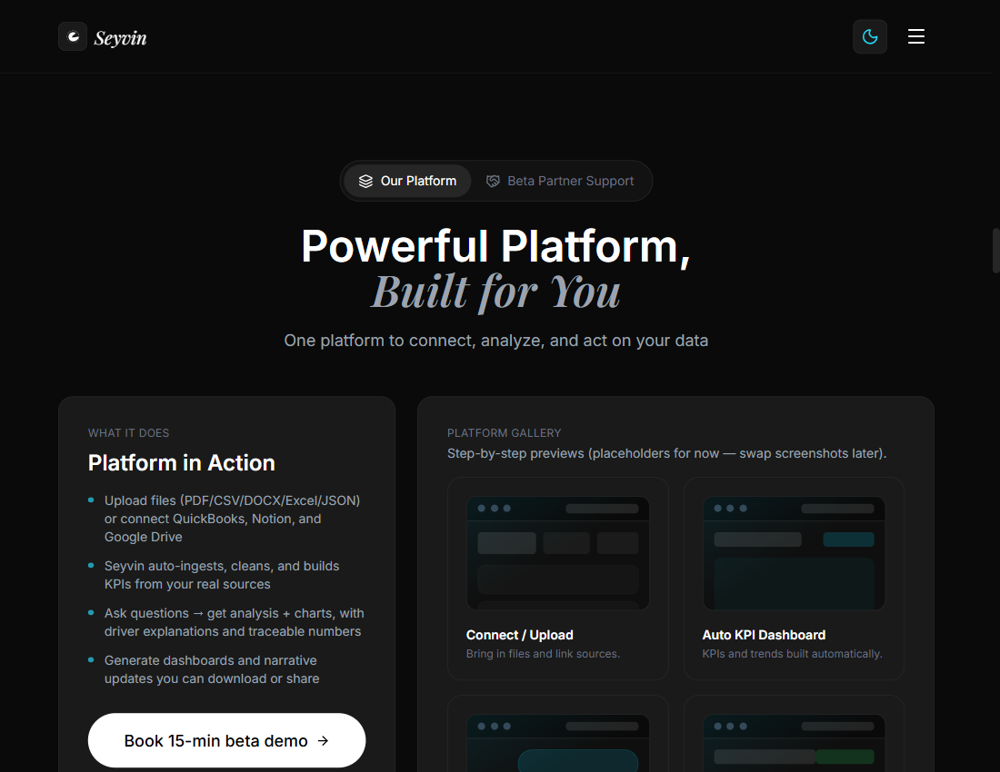

This section contains two tabs. **Default render** is “Our Platform”.

### Toggle labels
- “Our Platform”
- “Services”

### Header copy (changes per tab)
- **Platform tab headline**
  - “Powerful Platform,”
  - “Built for You”
- **Platform tab subheadline**
  - “One platform to connect, analyze, and act on your data”

- **Services tab headline** (when switched)
  - “Support Built Around You,”
  - “For Our Partners”
- **Services tab subheadline** (when switched)
  - “We offer hands-on support for founders, investors, and department leaders: from clean data and KPI setup to decision-ready dashboards and updates. We can also build custom agents and tools for your use cases, integrated with your data providers.”

### Tab content: Our Platform (default)

#### Left card (“Platform in Action”)
- Label: “What it does”
- Title: “Platform in Action”
- Bullet list:
  - “Upload files (PDF/CSV/DOCX/Excel/JSON) or connect QuickBooks, Notion, and Google Drive”
  - “Seyvin auto-ingests, cleans, and builds KPIs from your real sources”
  - “Ask questions → get analysis + charts, with driver explanations and traceable numbers”
  - “Generate dashboards and narrative updates you can download or share”
- Buttons:
  - Primary: **“Book 15-min beta demo”**
  - Secondary: “See the step-by-step ↓”

#### Right card (“Platform gallery”)
- Label: “Platform gallery”
- Helper text: “Step-by-step previews (placeholders for now — swap screenshots later).”
- Preview card titles + captions:
  - “Connect / Upload” — “Bring in files and link sources.”
  - “Auto KPI Dashboard” — “KPIs and trends built automatically.”
  - “Ask → Analysis + Chart” — “Questions turn into visuals + drivers.”
  - “Write-up → Export/Share” — “Narratives with charts, ready to send.”

### Tab content: Services (alternate view)

#### Card: KPI & Dashboard Setup
- Task list items:
  - “KPI mapping + definitions” (done)
  - “Connect any sources” (done)
  - “First dashboard + insights” (pending)
  - “First shareable update” (pending)
- Title: “KPI & Dashboard Setup”
- Paragraph:
  - “Built for founders, investors, and department leaders: we map KPIs, align definitions, and ship your first dashboard so the numbers are consistent and repeatable.”

#### Card: Data Connection + Validation
- Title: “Data Connection + Validation”
- Paragraph:
  - “We connect sources, validate the “source of truth,” and make sure the same metric means the same thing everywhere.”
- Tag row includes:
  - “We help setup”
  - “QuickBooks”
  - “Notion”
  - “Google Drive”
  - “CSV / Excel”
  - “PDF / DOCX”

#### Wide card: Briefs & Update Templates
- Visual list items:
  - “Weekly ops review dashboard” (ready) — “Template pack”
  - “Month-end close summary” (beta) — “Template pack”
  - “Board / investor update” (beta) — “Template pack”
- Title: “Briefs & Update Templates”
- Paragraph:
  - “We set up reusable write-up templates with charts you can download or share — for founder visibility, team follow-ups, month-end, and investor updates.”

#### Wide card: Enablement + Governance
- Title: “Enablement + Governance”
- Paragraph:
  - “We help your team ask better questions, standardize definitions, and build a workflow leaders can trust — with traceable numbers.”
- CTA button:
  - **“Book 15-min beta demo”**

#### “What happens in beta” chips
- “Connect any sources”
- “First dashboard”
- “First insights”
- “First shareable updates”

---

## 06) How it works (`Process`, `#process`)

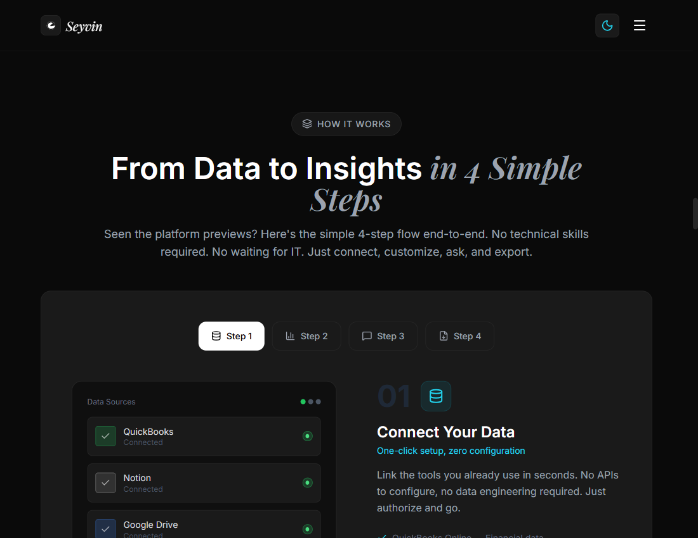

- **Section header**
  - Badge: “HOW IT WORKS”
  - Title: “From Data to Insights”
  - Title accent: “in 4 Simple Steps”
  - Description: “Seen the platform previews? Here's the simple 4-step flow end-to-end. No technical skills required. No waiting for IT. Just connect, customize, ask, and export.”

### Step tabs
- “Step 1”
- “Step 2”
- “Step 3”
- “Step 4”

### Step 1 copy (“Connect Your Data”)
- Title: “Connect Your Data”
- Subtitle: “One-click setup, zero configuration”
- Description: “Link the tools you already use in seconds. No APIs to configure, no data engineering required. Just authorize and go.”
- Features list:
  - “QuickBooks Online — Financial data”
  - “Notion — Documents & wikis”
  - “Google Drive — Files & spreadsheets”
  - “CSV/Excel — Upload any data”
- Deliverable chip: “All your data sources connected”
- Visual labels (in the mock UI)
  - “Data Sources”
  - Status: “Connected” (per listed integration)

### Step 2 copy (“Choose Your KPIs”)
- Title: “Choose Your KPIs”
- Subtitle: “Personalized dashboards in seconds”
- Description: “Tell us what metrics matter to you. Seyvin instantly generates a personalized dashboard with your chosen KPIs, pulling live data from all your connected sources.”
- Features list:
  - “Revenue & MRR tracking”
  - “Cash runway & burn rate”
  - “Customer acquisition metrics”
  - “Custom KPIs for your business”
- Result block:
  - “Your personalized dashboard with live KPIs from all your data sources”
- Deliverable chip: “Live dashboard with your KPIs”
- Visual labels (in the mock UI)
  - “Your Dashboard”
  - “Live Data”

### Step 3 copy (“Ask Anything”)
- Title: “Ask Anything”
- Subtitle: “Natural conversations, real insights”
- Description: “Talk to your data like a colleague. Ask any question in plain English and get instant answers backed by your actual data — complete with charts and visualizations.”
- Examples list:
  - “What's driving our revenue growth this quarter?”
  - “Compare expenses vs. last month”
  - “Which customers have the highest LTV?”
  - “Show me cash flow trends”
- Result block:
  - “Interactive charts and insights backed by your real data”
- Deliverable chip: “Data-backed answers with visuals”
- Visual labels (in the mock UI)
  - “Chat with Seyvin”
  - User bubble text: “Show me revenue trends this quarter”
  - Assistant bubble text: “Revenue is up 24% this quarter. Here's the breakdown:”
  - Hint: “Ask a follow-up question...”

### Step 4 copy (“Generate & Export Reports”)
- Title: “Generate & Export Reports”
- Subtitle: “Board-ready in one command”
- Description: “Transform any insight into a professional report. Ask Seyvin to create investor updates, financial summaries, or custom reports — then download and share.”
- Features list:
  - “Investor update reports”
  - “Monthly financial summaries”
  - “Custom analysis reports”
  - “Export as PDF or share link”
- Result block:
  - “Professional reports ready to download and share”
- Deliverable chip: “Downloadable, shareable reports”
- Visual labels (in the mock UI)
  - “Report Generator”
  - Status: “Ready”
  - Report name: “Q4 Investor Update”
  - Outline items:
    - “Executive Summary”
    - “Financial Highlights”
    - “Key Metrics & Growth”
    - “Next Quarter Outlook”
  - Buttons:
    - “Download PDF”
    - “Share Link”

---

## 07) Features (`Features`, `#features`)

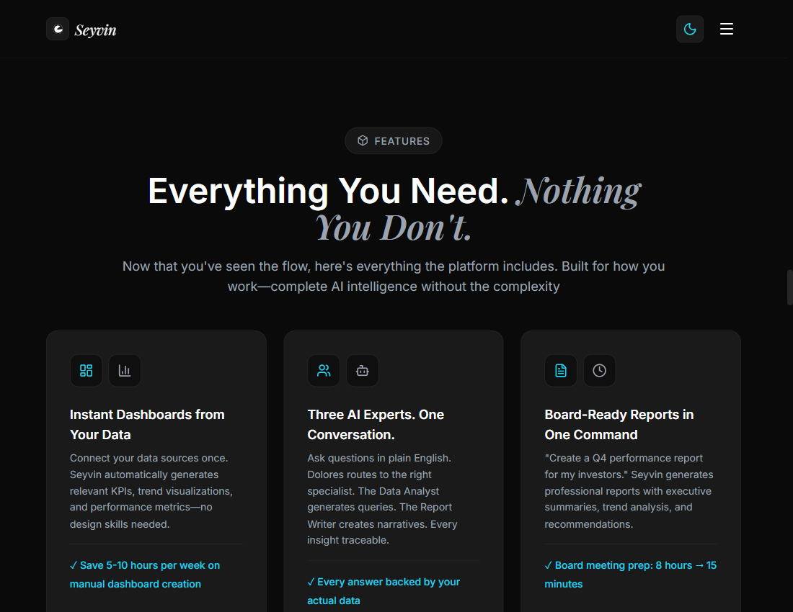

- **Section header**
  - Badge: “FEATURES”
  - Title: “Everything You Need.”
  - Title accent: “Nothing You Don't.”
  - Description: “Now that you've seen the flow, here's everything the platform includes. Built for how you work—complete AI intelligence without the complexity”

### Primary feature cards (3)
- **Instant Dashboards from Your Data**
  - Description: “Connect your data sources once. Seyvin automatically generates relevant KPIs, trend visualizations, and performance metrics—no design skills needed.”
  - Proof: “Save 5-10 hours per week on manual dashboard creation”
- **Three AI Experts. One Conversation.**
  - Description: “Ask questions in plain English. Dolores routes to the right specialist. The Data Analyst generates queries. The Report Writer creates narratives. Every insight traceable.”
  - Proof: “Every answer backed by your actual data”
- **Board-Ready Reports in One Command**
  - Description: “"Create a Q4 performance report for my investors." Seyvin generates professional reports with executive summaries, trend analysis, and recommendations.”
  - Proof: “Board meeting prep: 8 hours → 15 minutes”

### Secondary feature cards (5)
- “Natural Language Querying” — “Ask in English, get instant answers. No SQL required.”
- “Multi-Source Integration” — “QuickBooks, Notion, Google Drive, CSV, and more.”
- “Conversational Chart Editing” — “Customize any visualization by describing what you want.”
- “Centralized Knowledge Base” — “Unified, searchable data across your entire business.”
- “AI Agent Teams & Workflows” — “Build custom workflows without code.”

---

## 08) Use cases (`Clients`, `#clients`)

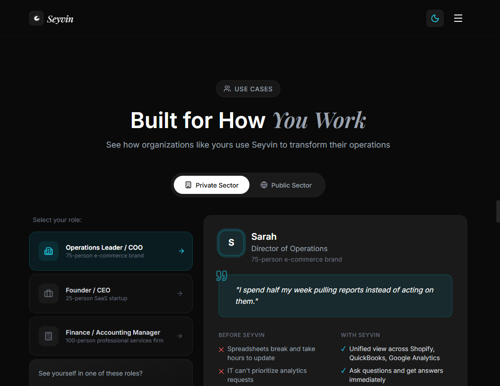

- **Section header**
  - Badge: “USE CASES”
  - Title: “Built for How”
  - Title accent: “You Work”
  - Description: “See how organizations like yours use Seyvin to transform their operations”
- **Sector toggle labels**
  - “Private Sector”
  - “Public Sector”
- **Persona selector helper**
  - “Select your role:”
- **Sidebar CTA**
  - “See yourself in one of these roles?”
  - Link label: “Book a personalized demo”

### Private Sector personas (3)

#### Operations Leader / COO
- Company line: “75-person e-commerce brand”
- Quote: “I spend half my week pulling reports instead of acting on them.”
- Before Seyvin (frustrations)
  - “Spreadsheets break and take hours to update”
  - “IT can't prioritize analytics requests”
  - “Different tools show different numbers”
- With Seyvin
  - “Unified view across Shopify, QuickBooks, Google Analytics”
  - “Ask questions and get answers immediately”
  - “Auto-generated reports for leadership meetings”
- Sample query
  - “What's causing our fulfillment delays this month?”
- Result metric
  - Metric: “reporting time”
  - Before: “20 hours/week”
  - Now: “2 hours”
  - Improvement: “90%”

#### Founder / CEO
- Company line: “25-person SaaS startup”
- Quote: “I know the data exists, I just can't get to it fast enough.”
- Before Seyvin
  - “Can't afford a data team yet”
  - “Tried Tableau but too complex to set up”
  - “Board asks questions I can't answer immediately”
- With Seyvin
  - “Self-service analytics without technical skills”
  - “Board-ready reports generated automatically”
  - “Costs a fraction of hiring an analyst”
- Sample query
  - “Create an investor update with MRR, ARR, and runway analysis”
- Result metric
  - Metric: “board prep”
  - Before: “8 hours”
  - Now: “15 min”
  - Improvement: “97%”

#### Finance / Accounting Manager
- Company line: “100-person professional services firm”
- Quote: “I export to Excel and spend days building the same reports every month.”
- Before Seyvin
  - “QuickBooks data hard to analyze”
  - “Manual reconciliation takes days”
  - “Can't easily compare actual vs. budget”
- With Seyvin
  - “Deep QuickBooks integration”
  - “Automated P&L, Balance Sheet, Cash Flow analysis”
  - “Natural language queries on financial data”
- Sample query
  - “Compare actual vs. budget by department for Q4”
- Result metric
  - Metric: “month-end close”
  - Before: “10 days”
  - Now: “5 days”
  - Improvement: “50%”

### Public Sector personas (3)

#### Non-Profit Executive Director
- Company line: “40-person community health organization”
- Quote: “Grant reporting takes our team away from the work that actually matters.”
- Before Seyvin
  - “Donor reporting requires data from 6+ systems”
  - “Impact metrics scattered across programs”
  - “Board wants dashboards but no budget for analysts”
- With Seyvin
  - “Unified view of programs, grants, and financials”
  - “Auto-generated impact reports for funders”
  - “Track outcomes across all initiatives instantly”
- Sample query
  - “Show program outcomes by funding source for our annual report”
- Result metric
  - Metric: “grant reporting”
  - Before: “15 hours”
  - Now: “2 hours”
  - Improvement: “87%”

#### Research Administrator
- Company line: “Mid-size university research office”
- Quote: “Faculty need data for grants, but our systems don't talk to each other.”
- Before Seyvin
  - “Research data siloed across departments”
  - “Compliance reporting is manual and error-prone”
  - “Grant applications need metrics we can't easily pull”
- With Seyvin
  - “Connect research databases, HR, and finance systems”
  - “Compliance dashboards updated automatically”
  - “Natural language queries for grant proposals”
- Sample query
  - “What's our research output by department and funding agency this year?”
- Result metric
  - Metric: “compliance audits”
  - Before: “3 weeks”
  - Now: “3 days”
  - Improvement: “85%”

#### Government Program Manager
- Company line: “State economic development agency”
- Quote: “We have the data to show impact, but no way to analyze it quickly.”
- Before Seyvin
  - “Legislative reporting deadlines are stressful”
  - “Data lives in legacy systems and spreadsheets”
  - “Public transparency requests take weeks”
- With Seyvin
  - “Connect legacy systems without IT overhaul”
  - “Auto-generate legislative and public reports”
  - “Track program KPIs across all initiatives”
- Sample query
  - “Create a report on job creation by county for the budget committee”
- Result metric
  - Metric: “legislative reports”
  - Before: “2 weeks”
  - Now: “2 days”
  - Improvement: “86%”

---

## 09) Integrations (`Integrations`, `#integrations`)

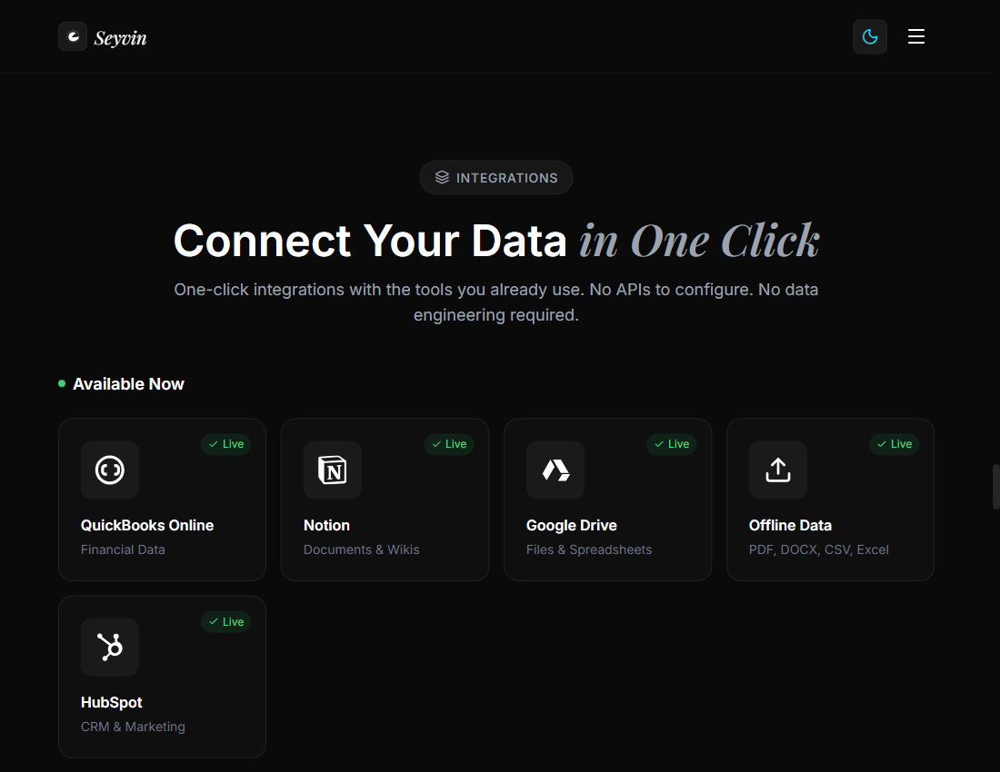

- **Section header**
  - Badge: “INTEGRATIONS”
  - Title: “Connect Your Data”
  - Title accent: “in One Click”
  - Description: “One-click integrations with the tools you already use. No APIs to configure. No data engineering required.”

### Available Now
- Heading: “Available Now”
- Integration cards (name — category — status badge)
  - “QuickBooks Online” — “Financial Data” — “Live”
  - “Notion” — “Documents & Wikis” — “Live”
  - “Google Drive” — “Files & Spreadsheets” — “Live”
  - “Offline Data” — “PDF, DOCX, CSV, Excel” — “Live”
  - “HubSpot” — “CRM & Marketing” — “Live”

### Coming Soon
- Heading: “Coming Soon”
- Integration cards
  - “Shopify” — “E-commerce” — “Coming Soon”
  - “Google Analytics” — “Web Analytics” — “Coming Soon”
  - “Stripe” — “Payments” — “Coming Soon”
  - “Salesforce” — “CRM” — “Coming Soon”
  - “Xero” — “Accounting” — “Coming Soon”

### Request Integration
- Paragraph:
  - “Don't see your tool? We're adding new integrations every week based on user requests.”
- Link label:
  - “Request an integration →”

---

## 10) FAQ (`FAQ`, `#faq`)

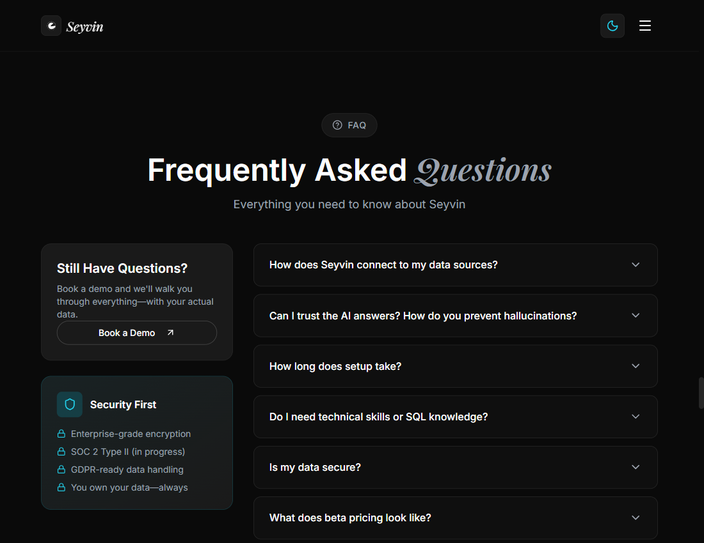

- **Section header**
  - Badge: “FAQ”
  - Title: “Frequently Asked”
  - Title accent: “Questions”
  - Description: “Everything you need to know about Seyvin”

### Left column: cards

#### Card: Still Have Questions?
- Title: “Still Have Questions?”
- Paragraph: “Book a demo and we'll walk you through everything—with your actual data.”
- Button: “Book a Demo”

#### Card: Security First
- Title: “Security First”
- Bullet list:
  - “Enterprise-grade encryption”
  - “SOC 2 Type II (in progress)”
  - “GDPR-ready data handling”
  - “You own your data—always”

### FAQ accordion items (questions + full answers)
- **Q**: “How does Seyvin connect to my data sources?”
  - **A**: “Seyvin uses secure OAuth 2.0 connections for services like QuickBooks and Google Drive, and direct file uploads for CSV/Excel. We never store your passwords—you authorize access through each platform's secure login, and you can revoke access anytime.”
- **Q**: “Can I trust the AI answers? How do you prevent hallucinations?”
  - **A**: “Unlike generic chatbots, Seyvin's multi-agent architecture (Dolores, Data Analyst, Report Writer) cross-validates every insight. Every answer is traceable to your actual source data—you can verify any number. We never make up data; if the answer isn't in your data, we tell you.”
- **Q**: “How long does setup take?”
  - **A**: “Most customers connect their first data source within 5 minutes using our one-click integrations. You can start asking questions immediately. Full onboarding with all your data sources typically takes 1-2 days, not the months required by traditional BI tools.”
- **Q**: “Do I need technical skills or SQL knowledge?”
  - **A**: “Not at all. Seyvin is designed for business users. Ask questions in plain English like "What's our cash runway?" or "Show me MRR by customer segment." Our AI handles all the technical complexity—no SQL, no dashboard design skills required.”
- **Q**: “Is my data secure?”
  - **A**: “Absolutely. Your data is encrypted at rest and in transit using industry-standard protocols. We're SOC 2 Type II compliant (in progress) and GDPR-ready. We never train AI models on your business data. You own your data—disconnect or delete anytime.”
- **Q**: “What does beta pricing look like?”
  - **A**: “Pricing will be finalized based on beta participant feedback. Beta users get preferential founding member rates that will be locked in before public launch. There's no commitment during the beta period—you can evaluate the full platform risk-free.”
- **Q**: “What integrations do you support?”
  - **A**: “Currently: QuickBooks Online, Notion, Google Drive, and CSV/Excel uploads. Coming soon: Shopify, Google Analytics, HubSpot, Stripe, Salesforce, Xero, and more. We're adding new integrations every week based on user requests.”
- **Q**: “Can Seyvin generate reports for my board/investors?”
  - **A**: “Yes! This is one of our core features. Simply ask something like "Create a Q4 investor report with MRR, ARR, runway analysis, and key metrics." Seyvin generates professional, board-ready reports with executive summaries, trend analysis, and data-backed recommendations.”

---

## 11) Comparison (`Comparison`, `#comparison`)

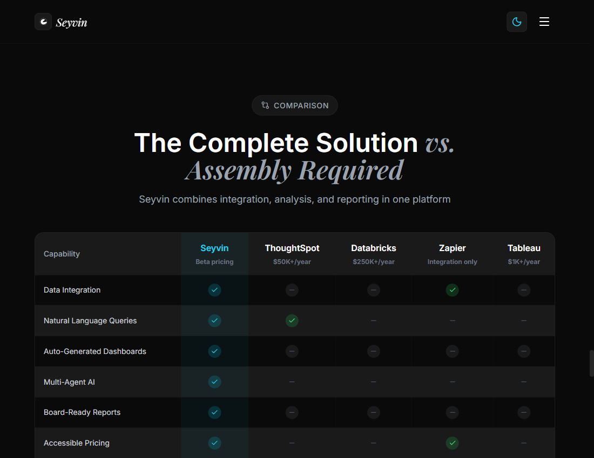

- **Section header**
  - Badge: “COMPARISON”
  - Title: “The Complete Solution”
  - Title accent: “vs. Assembly Required”
  - Description: “Seyvin combines integration, analysis, and reporting in one platform”

### Feature comparison table
- **Competitor columns** (name — pricing text)
  - “Seyvin” — “Beta pricing”
  - “ThoughtSpot” — “$50K+/year”
  - “Databricks” — “$250K+/year”
  - “Zapier” — “Integration only”
  - “Tableau” — “$1K+/year”
- **Capability rows**
  - “Data Integration”
  - “Natural Language Queries”
  - “Auto-Generated Dashboards”
  - “Multi-Agent AI”
  - “Board-Ready Reports”
  - “Accessible Pricing”
  - “Days to Setup”
  - “No Technical Skills”

### Differentiator cards (3)

#### vs. Traditional BI
- Subtitle: “Next-Generation AI Intelligence”
- Their limitations
  - “Manual dashboard design taking weeks”
  - “SQL knowledge required for queries”
  - “Static views that don't adapt”
  - “Expensive implementations”
- Seyvin advantage
  - “AI creates dashboards automatically”
  - “Ask questions in plain English”
  - “Dynamic insights that evolve”
  - “Up and running in days”

#### vs. Data Platforms
- Subtitle: “Business Intelligence, Not Infrastructure”
- Their limitations
  - “Need data engineers ($120K+ salary)”
  - “Months of implementation”
  - “$250K+ annual budget”
  - “Technical expertise required”
- Seyvin advantage
  - “No data warehouse required”
  - “Days to first insights”
  - “Accessible pricing”
  - “Zero technical skills needed”

#### vs. Chatbots
- Subtitle: “Your Data. Not Hallucinations.”
- Their limitations
  - “No connection to your data”
  - “Hallucinate convincing "facts"”
  - “Can't verify their answers”
  - “No business context”
- Seyvin advantage
  - “Connected to your business data”
  - “Multi-agent reduces hallucination”
  - “Every insight traceable to source”
  - “Built for business analytics”

---

## 12) Security (`Team`, `#security`)

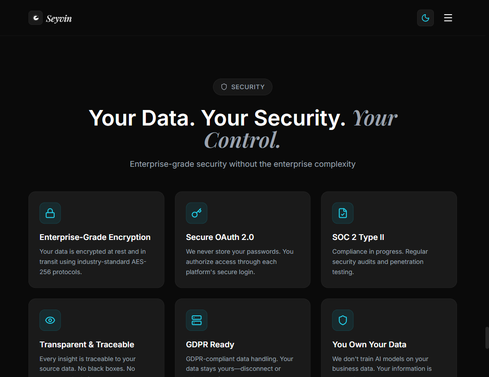

- **Section header**
  - Badge: “SECURITY”
  - Title: “Your Data. Your Security.”
  - Title accent: “Your Control.”
  - Description: “Enterprise-grade security without the enterprise complexity”

### Security feature cards (6)
- “Enterprise-Grade Encryption”
  - “Your data is encrypted at rest and in transit using industry-standard AES-256 protocols.”
- “Secure OAuth 2.0”
  - “We never store your passwords. You authorize access through each platform's secure login.”
- “SOC 2 Type II”
  - “Compliance in progress. Regular security audits and penetration testing.”
- “Transparent & Traceable”
  - “Every insight is traceable to your source data. No black boxes. No mystery calculations.”
- “GDPR Ready”
  - “GDPR-compliant data handling. Your data stays yours—disconnect or delete anytime.”
- “You Own Your Data”
  - “We don't train AI models on your business data. Your information is never shared.”

### Trust badge (footer card)
- “Questions about security? We're happy to discuss your specific requirements.”
- Link label: “Book a security-focused demo →”

---

## 13) Primary conversion CTA (`CTA`, `#cta`)

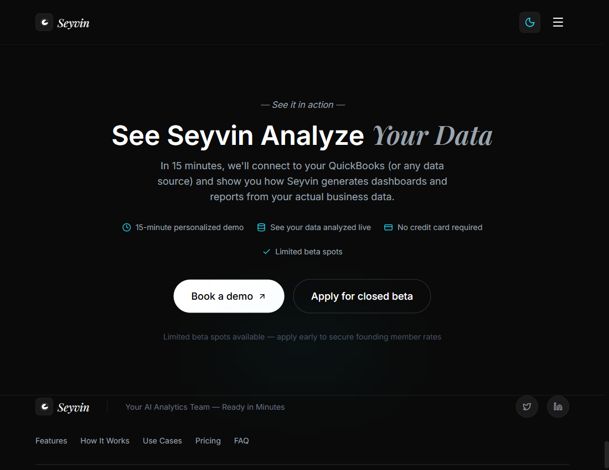

- **Pre-title**
  - “— See it in action —”
- **Headline**
  - “See Seyvin Analyze”
  - “Your Data”
- **Subtitle paragraph**
  - “In 15 minutes, we'll connect to your QuickBooks (or any data source) and show you how Seyvin generates dashboards and reports from your actual business data.”
- **Trust points row**
  - “15-minute personalized demo”
  - “See your data analyzed live”
  - “No credit card required”
  - “Limited beta spots”
- **CTA buttons**
  - Primary: **“Book a demo”**
  - Secondary: “Apply for closed beta”
- **Urgency line**
  - “Limited beta spots available — apply early to secure founding member rates”

---

## 14) Footer (`Footer`)

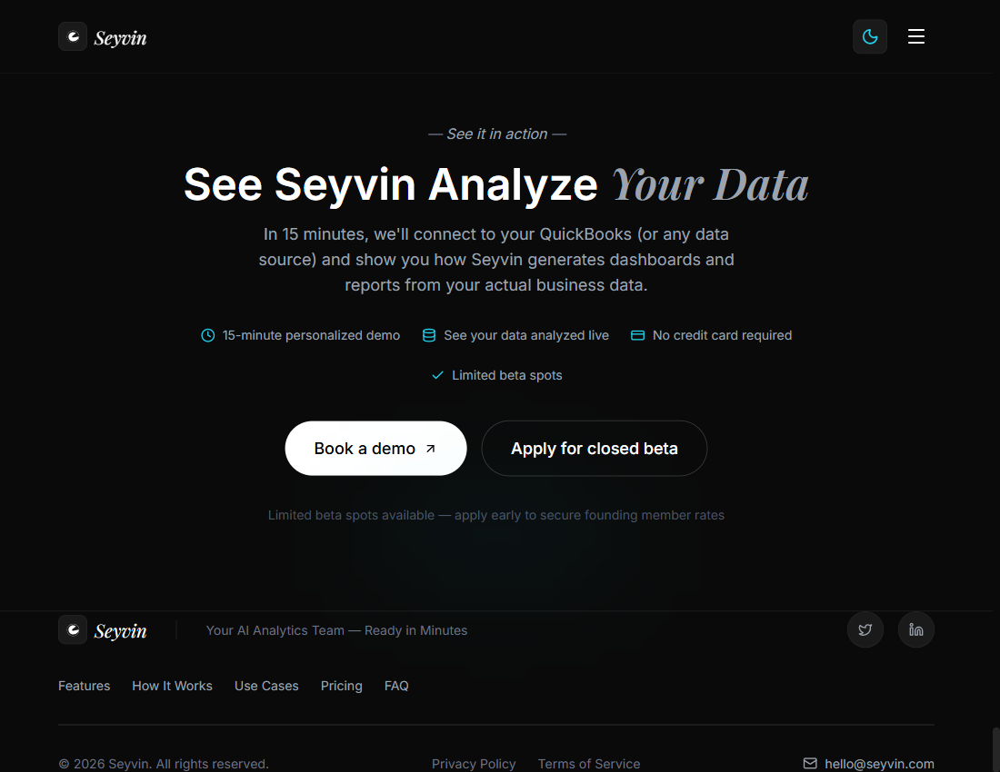

- **Brand**
  - “Seyvin”
- **Tagline**
  - “Your AI Analytics Team — Ready in Minutes”
- **Footer nav links**
  - “Features” → `#features`
  - “How It Works” → `#process`
  - “Use Cases” → `#clients`
  - “Pricing” → `#pricing` (note: Pricing section is currently not rendered)
  - “FAQ” → `#faq`
- **Legal links**
  - “Privacy Policy” → `/privacy`
  - “Terms of Service” → `/terms`
- **Contact**
  - Email: “hello@seyvin.com”
- **Copyright**
  - “© 2026 Seyvin. All rights reserved.”

